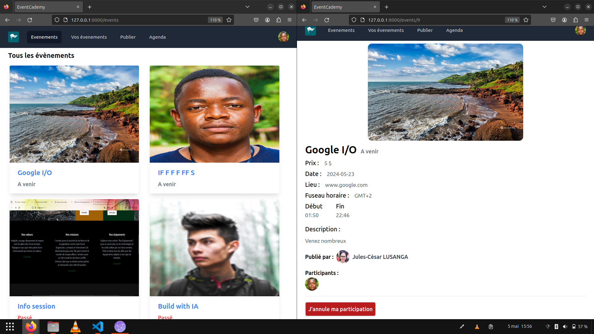

    <h1 align="center">EventCademy-Web</h1>
    This is the web version of EventCademy Android application.
    

        <a href="https://play.google.com/store/apps/details?id=com.yveskalume.eventcademy">Original Android APK Link</a> By
        <a href="https://github.com/yveskalume">@Yves Kalume</a>
    

## Stack (Need of Front-end developers)

- PHP (Laravel with blade)
- MySql
- Tailwindcss

## Features
- Users authentication (register and login)
- Create, Show, Update and Delete an Event
- Update and show user profile
- Reserve place for an event, if event is upcomming
- Get user events
- Get reserved events

    <h2>Screenshots</h2>
    

          
          
          
        
    

## Installation

1. Download the archive or clone the project using git
3. Create `.env` file from `.env.example`
4. Run `composer install` and `npm install`
4. Run `php key:generate`
5. Run migrations by executing `php artisan migrate` from the project root directory
6. Start servers by running commands `php artisan serve` and `npm run dev`
7. Open in browser http://127.0.0.1:8000